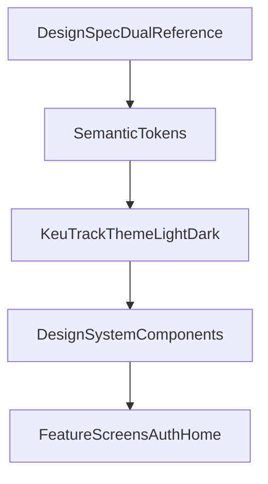

# Update Dual Theme Design System (Atelier)

## Tujuan

Menyatukan referensi `DESIGN.md` (light) dan `DESIGN (1).md` (dark) menjadi satu sistem tema `Financial Atelier` (light) + `Midnight Atelier` (dark), lalu menerapkannya ke komponen reusable utama agar styling tidak lagi inline per screen.

## Kondisi Saat Ini (Baseline)

- Token warna dan local theme sudah ada di `[/Users/chairulamri/Documents/Irul/MyProject/KeuTrack/core/designsystem/src/main/kotlin/com/mascill/keutrack/core/designsystem/theme/Colors.kt](/Users/chairulamri/Documents/Irul/MyProject/KeuTrack/core/designsystem/src/main/kotlin/com/mascill/keutrack/core/designsystem/theme/Colors.kt)`.
- Theme provider saat ini hanya 1 varian (dark-only) di `[/Users/chairulamri/Documents/Irul/MyProject/KeuTrack/core/designsystem/src/main/kotlin/com/mascill/keutrack/core/designsystem/theme/Theme.kt](/Users/chairulamri/Documents/Irul/MyProject/KeuTrack/core/designsystem/src/main/kotlin/com/mascill/keutrack/core/designsystem/theme/Theme.kt)`.
- Komponen masih inline style, contoh di `[/Users/chairulamri/Documents/Irul/MyProject/KeuTrack/features/auth/src/main/kotlin/com/mascill/keutrack/feature/auth/presentation/AuthScreen.kt](/Users/chairulamri/Documents/Irul/MyProject/KeuTrack/features/auth/src/main/kotlin/com/mascill/keutrack/feature/auth/presentation/AuthScreen.kt)`.

## Rencana Implementasi

1. **Refactor token warna jadi dual palette (light + dark)**

- Perluas token di `Colors.kt` agar memuat semantic surface tiers yang konsisten dengan dua referensi (`surface`, `surfaceContainerLow`, `surfaceContainerLowest`, `surfaceContainerHigh`, `surfaceContainerHighest`, `outlineVariantGhost`, `primaryGradientStart/End`).
- Pertahankan token existing yang masih dipakai agar migrasi bertahap aman.

1. **Upgrade `KeuTrackTheme` untuk mode light/dark terkontrol**

- Ubah `Theme.kt` agar punya dua set token (`financialLight`, `midnightDark`) dan parameter pemilih tema (system dark atau override eksplisit).
- Sinkronkan `MaterialTheme.colors` dengan semantic token baru supaya komponen Material default ikut konsisten.

1. **Tambahkan token bentuk & efek (shape/elevation) untuk aturan “No-Line + Tonal Layering”**

- Tambah file baru di modul themes (mis. `Shapes.kt`/`Effects.kt`) untuk radius (`md/lg/xl`), ghost border, dan ambient indigo glow.
- Tujuannya supaya komponen bisa pakai API token, bukan hard-coded `RoundedCornerShape(...)` dan nilai shadow tersebar.

1. **Buat komponen reusable design-system**

- Tambah paket komponen di `core/designsystem` untuk:
  - `KeuTrackButton` (primary gradient, secondary surface, tertiary ghost)
  - `KeuTrackCard` (tonal layering, tanpa divider)
  - `KeuTrackTextField` (filled container + focus indicator + error container)
  - `KeuTrackBottomNav` (floating/glass thumb-zone nav)
- Komponen expose parameter minimum (text/icon/state/onClick) dan default style dari token.

1. **Migrasi screen awal ke komponen baru**

- Ganti style inline di `AuthScreen.kt` dan screen utama berikutnya (minimal home) agar pakai komponen design-system reusable.
- Bersihkan hard-coded warna/shape/elevation yang tidak sesuai rule baru.

1. **Dokumentasi singkat penggunaan**

- Tambah/ubah dokumen design-system di repo (markdown) berisi mapping token + contoh pemakaian komponen light/dark, agar tim bisa adopsi konsisten.

1. **Validasi**

- Build/check lint untuk modul terdampak.
- Verifikasi visual cepat di preview Compose (light/dark) untuk button/card/input/nav.

## Arsitektur Target (Ringkas)

## Hasil Akhir yang Diharapkan

- Satu sumber token untuk dua persona visual (light+dark).
- Komponen UI inti reusable dan konsisten terhadap aturan desain baru.
- Penggunaan inline styling di feature layer berkurang signifikan, sehingga scaling UI lebih mudah dan maintainable.
