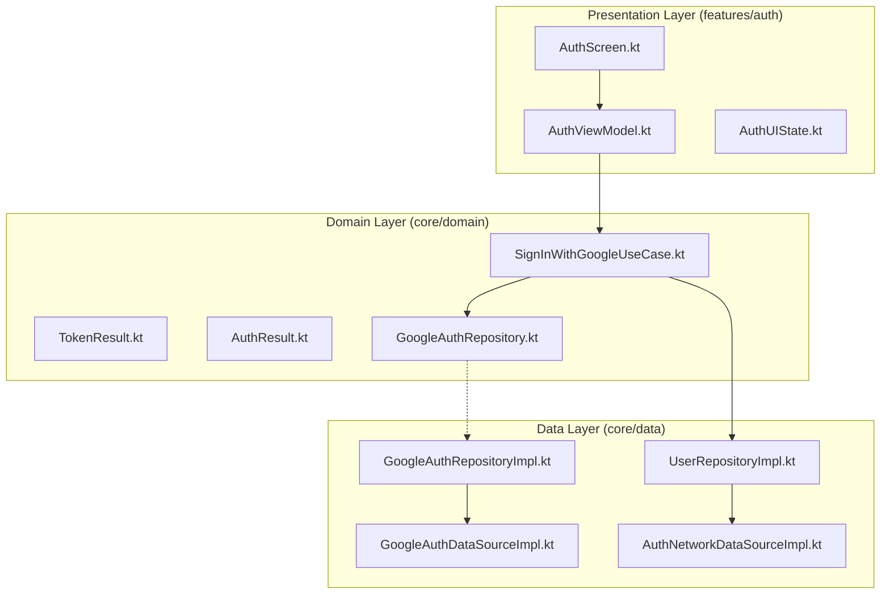

# Fix Google Auth Setup

## Architecture Overview



---

## Critical Fixes

### 1. Wrap navigation side effect in LaunchedEffect

**File:** [AuthScreen.kt](features/auth/src/main/kotlin/com/mascill/keutrack/feature/auth/presentation/AuthScreen.kt) (lines 54-62)

`navigateToHome()` is called directly during Composition. This causes it to fire on **every recomposition**, leading to duplicate navigation or crashes.

**Change:** Wrap `HandleAuthState` body in `LaunchedEffect(authState)`:

```kotlin
@Composable
private fun HandleAuthState(
    authState: AuthState,
    navigateToHome: () -> Unit
) {
    LaunchedEffect(authState) {
        if (authState is AuthState.Success) {
            navigateToHome()
        }
    }
}
```

### 2. Stop converting GetCredentialCancellationException to CancellationException

**File:** [GoogleAuthDataSourceImpl.kt](core/data/src/main/kotlin/com/mascill/keutrack/core/data/datasource/GoogleAuthDataSourceImpl.kt) (lines 43-50)

`CancellationException` has special meaning in structured concurrency. Converting user cancellation into it can cancel the parent coroutine scope unintentionally.

**Change:** Remove the `GetCredentialCancellationException` catch entirely -- let it propagate as a `GetCredentialException` (its superclass) to the Repository, which already handles `GetCredentialException`. Also remove the `CancellationException` re-throw since it's the only reason it was needed.

Simplified try-catch in DataSource:

```kotlin
return try {
    val result = credentialManager.getCredential(request = request, context = context)
    // ... credential extraction ...
} catch (e: CancellationException) {
    throw e
} catch (e: Exception) {
    Log.e("GoogleAuthDataSource", "getGoogleIdToken failed", e)
    throw e
}
```

### 3. Fix CancellationException handling in Repository

**File:** [GoogleAuthRepositoryImpl.kt](core/data/src/main/kotlin/com/mascill/keutrack/core/data/repository/GoogleAuthRepositoryImpl.kt) (lines 15-34)

Currently `CancellationException` is caught and consumed as `TokenResult.Cancelled`. This prevents proper coroutine cancellation propagation.

**Change:** Restructure the catch blocks:

```kotlin
override suspend fun getGoogleIdToken(): TokenResult {
    return try {
        val idToken = googleAuthDataSource.getGoogleIdToken()
        TokenResult.Success(idToken)
    } catch (e: CancellationException) {
        throw e
    } catch (e: GetCredentialCancellationException) {
        TokenResult.Cancelled
    } catch (e: NoCredentialException) {
        TokenResult.Error.NoCredential
    } catch (e: GetCredentialException) {
        if (e.message?.contains("network", ignoreCase = true) == true) {
            TokenResult.Error.Network
        } else {
            TokenResult.Error.Unknown(e.message, e)
        }
    } catch (e: Exception) {
        TokenResult.Error.Unknown(e.message, e)
    }
}
```

Key changes:

- `CancellationException` is **re-thrown** (must be first catch, before `GetCredentialCancellationException`)
- `GetCredentialCancellationException` is handled here (moved from DataSource)
- `NoCredentialException` maps to a new `TokenResult.Error.NoCredential` (see fix #6)
- Removed the now-redundant `"type_user_canceled"` message check (explicit class catch is more reliable)

---

## Medium Fixes

### 4. Add double-click protection

**File:** [AuthViewModel.kt](features/auth/src/main/kotlin/com/mascill/keutrack/feature/auth/presentation/AuthViewModel.kt) (line 38)

Multiple rapid taps can launch multiple concurrent sign-in coroutines.

**Change:** Guard `signInWithGoogle()`:

```kotlin
fun signInWithGoogle() {
    if (_authState.value == AuthState.Loading) return
    viewModelScope.launch(dispatcher.io) { ... }
}
```

### 5. Add state reset function after navigation

**File:** [AuthViewModel.kt](features/auth/src/main/kotlin/com/mascill/keutrack/feature/auth/presentation/AuthViewModel.kt)

After `Success` triggers navigation, the state remains `Success`. If the user ever returns to the auth screen, it shows loading instead of the sign-in button.

**Change:** Add a `resetState()` function and call it from `AuthRouting` after `navigateToHome`:

```kotlin
// AuthViewModel.kt
fun resetState() {
    _authState.value = AuthState.Idle
}
```

```kotlin
// AuthScreen.kt - HandleAuthState
LaunchedEffect(authState) {
    if (authState is AuthState.Success) {
        navigateToHome()
        onStateConsumed()
    }
}
```

### 6. Fix NoCredentialException misclassification + add new TokenResult type

**File:** [TokenResult.kt](core/domain/src/main/kotlin/com/mascill/keutrack/core/domain/model/TokenResult.kt)

`NoCredentialException` (no Google account on device) is currently mapped to `Network` error, which is misleading.

**Change:** Add `NoCredential` to `TokenResult.Error`:

```kotlin
sealed class Error : TokenResult() {
    data object Network : Error()
    data object NoCredential : Error()
    data class Unknown(val message: String?, val cause: Throwable? = null) : Error()
}
```

Then propagate this new type through:

- [SignInWithGoogleUseCase.kt](core/domain/src/main/kotlin/com/mascill/keutrack/core/domain/usecase/SignInWithGoogleUseCase.kt) -- map `TokenResult.Error.NoCredential` to a new `AuthResult.Error.NoCredential`
- [AuthResult.kt](core/domain/src/main/kotlin/com/mascill/keutrack/core/domain/model/AuthResult.kt) -- add `data object NoCredential : Error()`
- [AuthViewModel.kt](features/auth/src/main/kotlin/com/mascill/keutrack/feature/auth/presentation/AuthViewModel.kt) -- add `is AuthResult.Error.NoCredential` branch with appropriate message like "No Google account found on this device."

### 7. Move hardcoded Server Client ID to BuildConfig

**File:** [GoogleAuthDataSourceImpl.kt](core/data/src/main/kotlin/com/mascill/keutrack/core/data/datasource/GoogleAuthDataSourceImpl.kt) (line 24)

The Google Server Client ID is hardcoded in source code. Should be injected via `BuildConfig` so it can vary per flavor (dev/prod).

**Change:**

- Add `buildConfigField` in [core/data/build.gradle.kts](core/data/build.gradle.kts) with `buildFeatures { buildConfig = true }` and define the field per flavor
- Inject the ID via a `@Named` string or read from `BuildConfig` in the DataSource

---

## Minor Fixes

### 8. Cache CredentialManager instance

**File:** [GoogleAuthDataSourceImpl.kt](core/data/src/main/kotlin/com/mascill/keutrack/core/data/datasource/GoogleAuthDataSourceImpl.kt) (line 20)

`CredentialManager.create(context)` is called on every invocation.

**Change:** Move to a `private val`:

```kotlin
class GoogleAuthDataSourceImpl @Inject constructor(
    @ApplicationContext private val context: Context
) : GoogleAuthDataSource {
    private val credentialManager = CredentialManager.create(context)
    // ...
}
```

### 9. Remove unnecessary network check in signOut

**File:** [UserRepositoryImpl.kt](core/data/src/main/kotlin/com/mascill/keutrack/core/data/repository/UserRepositoryImpl.kt) (lines 47-56)

`firebaseAuth.signOut()` is a local operation. The network check + `ConnectivityManager` dependency is unnecessary.

**Change:** Simplify to:

```kotlin
override suspend fun signOut() {
    authDataSource.signOut()
}
```

Also remove `connectivityManager` from the constructor and its DI binding if no longer used elsewhere.
