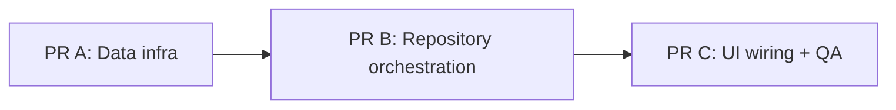

# PR A — Firebase Auth Email + Firestore Data Infrastructure

Parent plan: [`FIRESTORE_LOGIN_PLAN.md`](./FIRESTORE_LOGIN_PLAN.md)

## Goal
Deliver the **data-layer infrastructure** required by the Auth → Firestore profile flow, without wiring repository orchestration or UI yet.

After this PR:
- Hilt can inject `FirebaseFirestore`.
- `FirestoreNetworkDataSource` can upsert/read `/users/{uid}`.
- `AuthNetworkDataSource` can register and sign in with email/password via Firebase Auth.

This PR must **not** change login/register user-facing behavior yet. Existing Google sign-in continues to persist only to local DataStore (Firestore integration lands in **PR B**).

## PR Split Context

| PR | Scope | Status |
|---|---|---|
| **A (this)** | DI + Firestore data source + Auth email data source | Current |
| **B** | `UserRepository` API + `UserRepositoryImpl` orchestration (Auth → Firestore → Local + rollback) | Follow-up |
| **C** | `LoginViewModel` / `RegisterViewModel` + UI wiring + manual test | Follow-up |



## In Scope
1. Provide `FirebaseFirestore` in Hilt `FirebaseModule`.
2. Implement `FirestoreNetworkDataSource`:
   - `upsertUserProfile(user: User)`
   - `getUserProfile(uid: String): User?`
3. Extend `AuthNetworkDataSource` (+ impl) with:
   - `registerWithEmail(email, password, displayName)`
   - `signInWithEmail(email, password)`
4. Keep existing Google Auth methods working as-is.

## Out of Scope (do not touch in PR A)
- `UserRepository` / `UserRepositoryImpl` orchestration or new domain methods
- `LoginViewModel`, `RegisterViewModel`, `LoginScreen`, `RegisterScreen`
- Local DataStore persist/clear changes for Firestore failure rollback
- Firestore security rules files (configure in Firebase Console separately if needed)
- `syncUserProfile()` implementation
- Feature-module Firebase dependencies

## Files to Change

### Must edit
| File | Why |
|---|---|
| [`core/data/src/main/kotlin/com/mascill/keutrack/core/data/di/FirebaseModule.kt`](core/data/src/main/kotlin/com/mascill/keutrack/core/data/di/FirebaseModule.kt) | Add `provideFirebaseFirestore()` |
| [`core/data/src/main/kotlin/com/mascill/keutrack/core/data/datasource/FirestoreNetworkDataSource.kt`](core/data/src/main/kotlin/com/mascill/keutrack/core/data/datasource/FirestoreNetworkDataSource.kt) | Implement upsert/get against `/users/{uid}` |
| [`core/data/src/main/kotlin/com/mascill/keutrack/core/data/datasource/AuthNetworkDataSource.kt`](core/data/src/main/kotlin/com/mascill/keutrack/core/data/datasource/AuthNetworkDataSource.kt) | Declare email auth API |
| [`core/data/src/main/kotlin/com/mascill/keutrack/core/data/datasource/AuthNetworkDataSourceImpl.kt`](core/data/src/main/kotlin/com/mascill/keutrack/core/data/datasource/AuthNetworkDataSourceImpl.kt) | Implement email register/sign-in |

### Reference only (read, usually no edits)
| File | Why it matters |
|---|---|
| [`FIRESTORE_LOGIN_PLAN.md`](./FIRESTORE_LOGIN_PLAN.md) | Full product/technical contract, field rules, error mapping |
| [`core/domain/src/main/kotlin/com/mascill/keutrack/core/domain/model/User.kt`](core/domain/src/main/kotlin/com/mascill/keutrack/core/domain/model/User.kt) | Domain user shape used by Firestore upsert/get |
| [`core/data/src/main/kotlin/com/mascill/keutrack/core/data/model/AuthUserResponse.kt`](core/data/src/main/kotlin/com/mascill/keutrack/core/data/model/AuthUserResponse.kt) | DTO returned by Auth data source |
| [`core/data/src/main/kotlin/com/mascill/keutrack/core/data/mapper/AuthUserMapper.kt`](core/data/src/main/kotlin/com/mascill/keutrack/core/data/mapper/AuthUserMapper.kt) | Map `FirebaseUser` ↔ `AuthUserResponse` / `User` |
| [`core/data/src/main/kotlin/com/mascill/keutrack/core/data/di/CommonDataSourceModule.kt`](core/data/src/main/kotlin/com/mascill/keutrack/core/data/di/CommonDataSourceModule.kt) | Confirms Auth DS is bound via `@Binds`; Firestore DS is concrete `@Inject` (no bind needed) |
| [`core/data/build.gradle.kts`](core/data/build.gradle.kts) | Confirms `firebase-auth` + `firebase-firestore` deps already present |
| [`gradle/libs.versions.toml`](gradle/libs.versions.toml) | Catalog entries for Firebase BOM / Auth / Firestore |

### Explicitly leave alone in PR A
| File | Reason |
|---|---|
| `core/domain/.../UserRepository.kt` | Domain API expansion belongs to PR B |
| `core/data/.../UserRepositoryImpl.kt` | Orchestration + rollback belongs to PR B |
| `features/auth/**` | UI/ViewModel wiring belongs to PR C |

## Implementation Guide

### Step 1 — Provide `FirebaseFirestore`

In `FirebaseModule.kt`, add:

```kotlin
@Provides
@Singleton
fun provideFirebaseFirestore(): FirebaseFirestore =
    FirebaseFirestore.getInstance()
```

Notes:
- Mirror the existing `provideFirebaseAuth()` style.
- `FirestoreNetworkDataSource` already `@Inject`s `FirebaseFirestore`; once provided, Hilt graph resolves.

### Step 2 — Implement `FirestoreNetworkDataSource`

Target API:

```kotlin
suspend fun upsertUserProfile(user: User)

suspend fun getUserProfile(uid: String): User?
```

Collection path: `users` → document id = `user.uid` / `uid`.

#### Document contract (`/users/{uid}`)

| Field | Create (missing doc) | Update (existing doc) |
|---|---|---|
| `uid` | set | keep |
| `displayName` | set from `user` | update from `user` |
| `email` | set from `user` | update from `user` |
| `photoUrl` | set from `user` | update from `user` |
| `currency` | default `"IDR"` | **do not overwrite** |
| `familyId` | `null` | **do not overwrite** |
| `familyRole` | `null` | **do not overwrite** |
| `createdAt` | `FieldValue.serverTimestamp()` | **do not overwrite** |
| `updatedAt` | `FieldValue.serverTimestamp()` | `FieldValue.serverTimestamp()` |

Rules:
- Never write password / Google token / credentials.
- Prefer a **Firestore transaction**:
  1. Read `/users/{uid}`.
  2. If missing → set create payload (defaults + profile fields + timestamps).
  3. If present → update only profile fields + `updatedAt`.
- Use `await()` (already used in Auth impl) for suspend bridging.
- Let Firebase/Firestore exceptions propagate; mapping to `AuthResult` happens in PR B.

#### Suggested `getUserProfile` behavior
- Read document.
- Return `null` if missing.
- Map existing fields into domain `User` (`currency`/`familyId`/`familyRole` from doc when present; otherwise domain defaults).

Optional helper (same file or private functions):
- constants for collection/field names (`USERS`, `UID`, `DISPLAY_NAME`, …) to avoid magic strings.

### Step 3 — Extend Auth email API

#### Interface (`AuthNetworkDataSource`)

Keep existing:

```kotlin
fun getCurrentUser(): AuthUserResponse?
suspend fun signInWithGoogle(idToken: String): AuthUserResponse?
suspend fun signOut()
```

Add:

```kotlin
suspend fun registerWithEmail(
    email: String,
    password: String,
    displayName: String,
): AuthUserResponse?

suspend fun signInWithEmail(
    email: String,
    password: String,
): AuthUserResponse?
```

#### Implementation (`AuthNetworkDataSourceImpl`)

`registerWithEmail`:
1. `firebaseAuth.createUserWithEmailAndPassword(email, password).await()`
2. Optionally update Firebase profile display name:
   - `user.updateProfile(UserProfileChangeRequest.Builder().setDisplayName(displayName).build()).await()`
3. Return `mapper.mapToResponse(user)` (ensure `displayName` is reflected; if Auth profile update is skipped, map with provided `displayName` carefully — prefer updating Auth profile so `getCurrentUser()` stays consistent).

`signInWithEmail`:
1. `firebaseAuth.signInWithEmailAndPassword(email, password).await()`
2. Return `authResult.user?.let(mapper::mapToResponse)`

Do **not** catch-and-swallow Auth exceptions here. Let them bubble to repository (PR B) for `AuthResult` mapping.

Existing `signInWithGoogle` / `signOut` / `getCurrentUser` should remain behaviorally unchanged.

## Acceptance Criteria
- [ ] `FirebaseFirestore` is provided by Hilt and injectable.
- [ ] `FirestoreNetworkDataSource.upsertUserProfile` creates a new doc with defaults when missing.
- [ ] `upsertUserProfile` updates profile fields only when doc exists (preserves `currency`, `familyId`, `familyRole`, `createdAt`).
- [ ] `getUserProfile` returns mapped `User` or `null`.
- [ ] `registerWithEmail` / `signInWithEmail` compile and call the correct Firebase Auth APIs.
- [ ] No changes to `UserRepository`, ViewModels, or Screens.
- [ ] `./gradlew :core:data:compileDebugKotlin` (or `assembleDebug`) succeeds.

## Suggested Verification (infra only)
Because repository/UI are not wired yet, verification in PR A is mostly compile + optional isolated checks:

1. Build:
   ```bash
   ./gradlew :core:data:compileDebugKotlin
   ```
2. Code review checklist:
   - Transaction preserves protected fields.
   - No password fields written to Firestore maps.
   - Email Auth methods do not persist to DataStore.
3. Optional manual smoke (only if you temporarily call from a debug path — **do not commit temporary callers**):
   - Register email → Auth user appears in Firebase Console.
   - Upsert profile → `/users/{uid}` appears with expected fields.

Full end-to-end Google/email login tests belong to **PR C** after **PR B**.

## Dependencies Already Available
No Gradle catalog changes expected for PR A if these already exist (current repo state):
- `firebase-bom`, `firebase-auth`, `firebase-firestore` in `libs.versions.toml`
- `keutrack.lib.firebase` applied in `core/data/build.gradle.kts`
- Auth + Firestore implementation deps on `:core:data`

If compile fails on Firestore types, verify `firebase-firestore` is still declared in `core/data/build.gradle.kts`.

## Draft PR Description

```markdown
## Summary
- Provide FirebaseFirestore via Hilt FirebaseModule.
- Implement FirestoreNetworkDataSource upsert/get for /users/{uid}.
- Add email/password register and sign-in methods to AuthNetworkDataSource.

## Out of scope
- Repository orchestration and AuthResult mapping (PR B)
- Login/Register UI wiring (PR C)

## Test plan
- [ ] ./gradlew :core:data:compileDebugKotlin
- [ ] Confirm upsert create/update field rules in code review
- [ ] Confirm no UI/repository behavior changes
```

## Handoff to PR B
PR B should consume these APIs from `UserRepositoryImpl`:

```text
Auth success
  → firestoreDataSource.upsertUserProfile(user)  // Google + register
  → or getUserProfile + optional upsert          // email login
  → local persist on success
  → clear local + auth signOut on Firestore failure
```

Do not start that orchestration in this PR.
