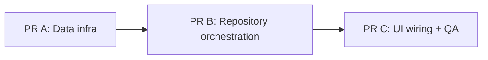
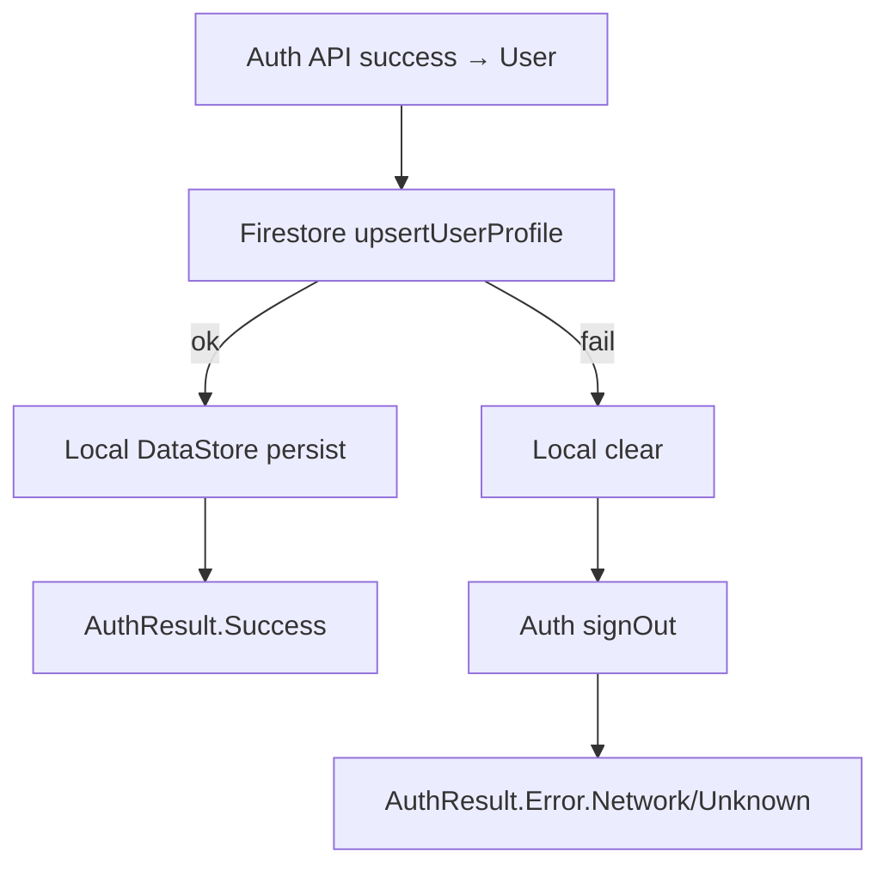

# PR B — UserRepository Orchestration (Auth → Firestore → Local)

Parent plan: [`FIRESTORE_LOGIN_PLAN.md`](./FIRESTORE_LOGIN_PLAN.md)  
Depends on: [`PR_A_FIRESTORE_AUTH_INFRA.md`](./PR_A_FIRESTORE_AUTH_INFRA.md) (merged or available on branch)

## Goal
Wire **domain + repository orchestration** so every successful Firebase Auth sign-in/register:

1. Writes or validates the profile in Firestore (`/users/{uid}`).
2. Persists the user to local DataStore only after Firestore succeeds.
3. Rolls back (clear local + Auth sign-out) if Firestore fails.

After this PR:
- `UserRepository` exposes `registerWithEmail` and `signInWithEmail`.
- `signInWithGoogle` also upserts Firestore before local persist.
- Feature UI can call the new APIs, but **UI wiring itself stays in PR C**.

## PR Split Context

| PR | Scope | Status |
|---|---|---|
| **A** | DI + `FirestoreNetworkDataSource` + Auth email data source | Prerequisite |
| **B (this)** | `UserRepository` API + `UserRepositoryImpl` orchestration + error mapping | Current |
| **C** | Login/Register ViewModels + screen callbacks + manual E2E test | Follow-up |



## In Scope
1. Extend `UserRepository` with email register/sign-in methods.
2. Inject `FirestoreNetworkDataSource` into `UserRepositoryImpl`.
3. Update orchestration for:
   - `signInWithGoogle`
   - `registerWithEmail`
   - `signInWithEmail`
4. Shared success / rollback helpers (recommended).
5. Map Auth + Firestore exceptions to existing `AuthResult` types.

## Out of Scope (do not touch in PR B)
- `LoginScreen` / `RegisterScreen` callback wiring
- `LoginViewModel` / `RegisterViewModel` email methods (unless needed only as compile fixes — prefer leave for PR C)
- Changes to `FirestoreNetworkDataSource` / `AuthNetworkDataSource` APIs from PR A (consume them as-is)
- Firestore security rules
- Forgot-password / email verification
- Full `syncUserProfile()` implementation (optional mini follow-up; leave TODO unless trivial)

## Prerequisites from PR A
Confirm these already exist and compile:
- `FirebaseModule.provideFirebaseFirestore()`
- `FirestoreNetworkDataSource.upsertUserProfile(user)`
- `FirestoreNetworkDataSource.getUserProfile(uid)`
- `AuthNetworkDataSource.registerWithEmail(...)`
- `AuthNetworkDataSource.signInWithEmail(...)`

## Files to Change

### Must edit
| File | Why |
|---|---|
| [`core/domain/src/main/kotlin/com/mascill/keutrack/core/domain/repository/UserRepository.kt`](core/domain/src/main/kotlin/com/mascill/keutrack/core/domain/repository/UserRepository.kt) | Add email domain APIs |
| [`core/data/src/main/kotlin/com/mascill/keutrack/core/data/repository/UserRepositoryImpl.kt`](core/data/src/main/kotlin/com/mascill/keutrack/core/data/repository/UserRepositoryImpl.kt) | Orchestrate Auth → Firestore → Local + rollback + error mapping |

### Reference only (read, usually no edits)
| File | Why it matters |
|---|---|
| [`FIRESTORE_LOGIN_PLAN.md`](./FIRESTORE_LOGIN_PLAN.md) | Canonical flows, rollback, error mapping cheatsheet |
| [`PR_A_FIRESTORE_AUTH_INFRA.md`](./PR_A_FIRESTORE_AUTH_INFRA.md) | Handoff contract for data-source APIs |
| [`core/domain/src/main/kotlin/com/mascill/keutrack/core/domain/model/AuthResult.kt`](core/domain/src/main/kotlin/com/mascill/keutrack/core/domain/model/AuthResult.kt) | Keep sealed hierarchy unchanged |
| [`core/domain/src/main/kotlin/com/mascill/keutrack/core/domain/model/User.kt`](core/domain/src/main/kotlin/com/mascill/keutrack/core/domain/model/User.kt) | Domain user shape |
| [`core/data/src/main/kotlin/com/mascill/keutrack/core/data/datasource/FirestoreNetworkDataSource.kt`](core/data/src/main/kotlin/com/mascill/keutrack/core/data/datasource/FirestoreNetworkDataSource.kt) | `upsertUserProfile` / `getUserProfile` |
| [`core/data/src/main/kotlin/com/mascill/keutrack/core/data/datasource/AuthNetworkDataSource.kt`](core/data/src/main/kotlin/com/mascill/keutrack/core/data/datasource/AuthNetworkDataSource.kt) | Auth methods to call |
| [`core/data/src/main/kotlin/com/mascill/keutrack/core/data/mapper/AuthUserMapper.kt`](core/data/src/main/kotlin/com/mascill/keutrack/core/data/mapper/AuthUserMapper.kt) | Map DTO → domain `User` |
| [`core/data/src/main/kotlin/com/mascill/keutrack/core/data/datasource/UserProfileLocalDataSource.kt`](core/data/src/main/kotlin/com/mascill/keutrack/core/data/datasource/UserProfileLocalDataSource.kt) | `persist` / `clear` / `observeSignedInUser` |
| [`core/data/src/main/kotlin/com/mascill/keutrack/core/data/di/CommonRepositoryModule.kt`](core/data/src/main/kotlin/com/mascill/keutrack/core/data/di/CommonRepositoryModule.kt) | Confirms `UserRepositoryImpl` binding (usually unchanged) |

### Explicitly leave alone in PR B
| File | Reason |
|---|---|
| `features/auth/**` | UI/ViewModel wiring belongs to PR C |
| `FirebaseModule.kt` / Auth+Firestore data sources | Already delivered in PR A |

## Implementation Guide

### Step 1 — Extend domain `UserRepository`

Add:

```kotlin
suspend fun registerWithEmail(
    fullName: String,
    email: String,
    password: String,
): AuthResult

suspend fun signInWithEmail(
    email: String,
    password: String,
): AuthResult
```

Keep existing:
- `getCurrentUser()`
- `signInWithGoogle(idToken)`
- `signOut()`
- `syncUserProfile()`

Do **not** change `AuthResult` sealed types.

### Step 2 — Inject Firestore into `UserRepositoryImpl`

```kotlin
class UserRepositoryImpl @Inject constructor(
    private val authDataSource: AuthNetworkDataSource,
    private val firestoreDataSource: FirestoreNetworkDataSource,
    private val mapper: AuthUserMapper,
    private val userProfileLocalDataSource: UserProfileLocalDataSource,
) : UserRepository
```

`FirestoreNetworkDataSource` is a concrete `@Inject` class from PR A — no new Hilt `@Binds` needed.

### Step 3 — Shared orchestration helpers (recommended)

Extract private helpers to avoid duplicating rollback/error logic:

```kotlin
private suspend fun completeSignIn(user: User): AuthResult {
    return try {
        firestoreDataSource.upsertUserProfile(user)
        userProfileLocalDataSource.persist(user)
        AuthResult.Success(user)
    } catch (e: CancellationException) {
        throw e
    } catch (e: Exception) {
        rollbackAuthSession()
        mapFirestoreFailure(e)
    }
}

private suspend fun rollbackAuthSession() {
    userProfileLocalDataSource.clear()
    authDataSource.signOut()
}
```

Notes:
- Persist local **only after** Firestore succeeds.
- On Firestore failure, always clear local + sign out Auth before returning error.

### Step 4 — Update `signInWithGoogle`

Current (PR A baseline): Auth → local persist → Success.

Target:

```text
authDataSource.signInWithGoogle(idToken)
  → map to User
  → completeSignIn(user)   // upsert Firestore → persist local
```

If Auth returns null user → `AuthResult.Error.UserNotFound` (no Firestore call).

### Step 5 — Implement `registerWithEmail`

```text
authDataSource.registerWithEmail(email, password, fullName)
  → map to User (displayName should be fullName from Auth profile update in PR A)
  → completeSignIn(user)
```

Auth failures map via existing Auth catch blocks (see Error Mapping).

### Step 6 — Implement `signInWithEmail`

Per parent plan product decision: if Firestore profile is missing, **auto-upsert** from Auth user (do not hard-fail `UserNotFound`).

Recommended flow:

```text
authDataSource.signInWithEmail(email, password)
  → map to User (authUser)
  → existing = firestoreDataSource.getUserProfile(authUser.uid)
  → if existing == null:
        completeSignIn(authUser)          // creates doc via upsert
    else:
        completeSignIn(authUser)          // upsert refreshes profile fields only
```

Because `upsertUserProfile` already handles create vs update, email login can simply call `completeSignIn(authUser)` after Auth success.

Optional enrichment: if you want to return Firestore-enriched fields (`currency`, `familyId`, …) immediately:

```text
existing = getUserProfile(uid)
userToPersist = existing?.copy(
    displayName = authUser.displayName,
    email = authUser.email,
    photoUrl = authUser.photoUrl,
) ?: authUser
completeSignIn(userToPersist)
```

Prefer returning the enriched user when the document exists.

### Step 7 — Error mapping

Keep `CancellationException` rethrow.

| Source | Condition | Result |
|---|---|---|
| Auth / Firestore | `FirebaseNetworkException` or unavailable/network | `AuthResult.Error.Network` |
| Auth | `FirebaseAuthException` wrong/invalid credential, email in use, weak password | `AuthResult.Error.InvalidCredential` |
| Auth | user-not-found (if distinguishable) | `AuthResult.Error.UserNotFound` |
| Firestore | permission-denied / other `FirebaseFirestoreException` | `AuthResult.Error.Unknown(...)` |
| Other | unexpected | `AuthResult.Error.Unknown(message)` |

Implementation tip:
- Catch Firestore exceptions **after** Auth succeeds inside `completeSignIn` / dedicated mapper.
- You may need:
  - `com.google.firebase.firestore.FirebaseFirestoreException`
  - optionally inspect exception message/`code` for unavailable → Network

Do not introduce new `AuthResult` subclasses in this PR.

### Step 8 — `signOut` / `getCurrentUser`

- `signOut`: keep clear local then Auth sign-out (no Firestore delete).
- `getCurrentUser`: can remain as-is for PR B (observe local + hydrate from Auth onStart).  
  Do **not** require Firestore read on every cold start in this PR unless you intentionally expand scope.

### Step 9 — `syncUserProfile` (optional)
Leave TODO, or implement lightly:

```text
current Auth user → upsertUserProfile → persist local
```

If not done, document as follow-up in PR description.

## Target Flow (repository-only)



## Acceptance Criteria
- [ ] `UserRepository` has `registerWithEmail` and `signInWithEmail`.
- [ ] `signInWithGoogle` upserts Firestore before local persist.
- [ ] Register/login email repository methods call Auth then Firestore then local.
- [ ] Firestore failure clears local profile and signs out Firebase Auth.
- [ ] Exceptions map to existing `AuthResult` errors (Network / InvalidCredential / UserNotFound / Unknown).
- [ ] No password/credential written to Firestore (still enforced in PR A data source).
- [ ] No UI/ViewModel wiring changes in `features/auth`.
- [ ] `./gradlew :core:domain:compileDebugKotlin :core:data:compileDebugKotlin` (or `assembleDebug`) succeeds.

## Suggested Verification
Repository is not yet fully exercised from UI (PR C). For PR B:

1. Compile:
   ```bash
   ./gradlew :core:domain:compileDebugKotlin :core:data:compileDebugKotlin
   ```
2. Code review checklist:
   - Local persist never happens before Firestore success.
   - Rollback always pairs `clear()` + `signOut()`.
   - Google path no longer skips Firestore.
   - Email login uses auto-upsert when profile doc is missing.
3. Optional temporary debug call site (do **not** commit): invoke repository methods and confirm Firestore docs + rollback behavior.

Full manual Test Plan from parent doc belongs to **PR C**.

## Draft PR Description

```markdown
## Summary
- Extend UserRepository with email register/sign-in APIs.
- Orchestrate Auth → Firestore profile upsert → local DataStore persist.
- Roll back Auth session and local profile when Firestore fails.
- Wire Google sign-in through the same Firestore-backed completion path.

## Out of scope
- Login/Register UI and ViewModel wiring (PR C)

## Test plan
- [ ] ./gradlew :core:domain:compileDebugKotlin :core:data:compileDebugKotlin
- [ ] Code review: persist-after-Firestore and rollback ordering
- [ ] Confirm no features/auth UI changes
```

## Handoff to PR C
PR C should wire:

```text
RegisterScreen Sign Up → RegisterViewModel.registerWithEmail(...)
LoginScreen Login → LoginViewModel.signInWithEmail(...)
(Google buttons already call signInWithGoogle — will automatically gain Firestore behavior)
```

UI validation (empty fields, password confirm, min length) also lands in PR C.
