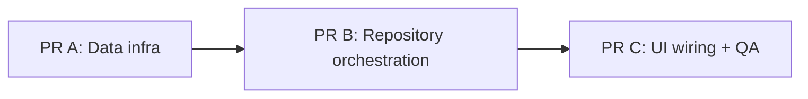
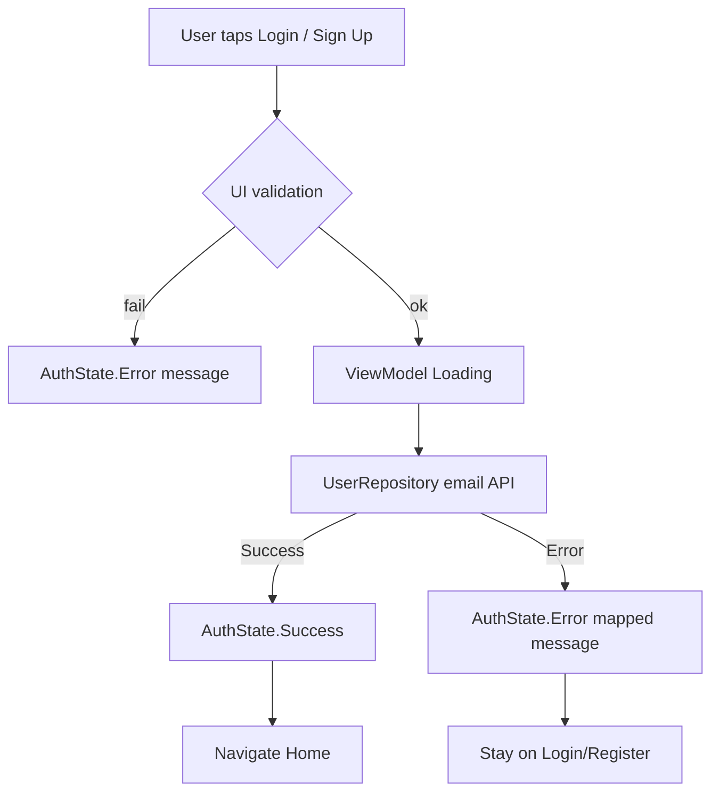

# PR C — Auth UI Wiring (Email Login / Register + E2E)

Parent plan: [`FIRESTORE_LOGIN_PLAN.md`](./FIRESTORE_LOGIN_PLAN.md)  
Depends on:
- [`PR_A_FIRESTORE_AUTH_INFRA.md`](./PR_A_FIRESTORE_AUTH_INFRA.md)
- [`PR_B_USER_REPOSITORY_ORCHESTRATION.md`](./PR_B_USER_REPOSITORY_ORCHESTRATION.md)

## Goal
Connect Login/Register screens to the repository APIs delivered in PR A + PR B so users can:

1. Register with email/password → Firebase Auth + Firestore profile + local session → Home.
2. Sign in with email/password → Firebase Auth + Firestore profile upsert/read + local session → Home.
3. Keep Google buttons working (they already call `signInWithGoogle`, which now includes Firestore via PR B).

This PR completes the end-to-end user-facing Auth → Firestore flow.

## PR Split Context

| PR | Scope | Status |
|---|---|---|
| **A** | DI + Firestore/Auth data sources | Prerequisite |
| **B** | `UserRepository` orchestration + rollback | Prerequisite |
| **C (this)** | ViewModels + screen callbacks + UI validation + manual E2E | Current |



## Current Baseline (before PR C)

| Location | Current behavior |
|---|---|
| `LoginRouting` | `onEmailLoginClick = { }` (no-op); Google wired |
| `RegisterRouting` | `onSignUpClick = { }` (no-op); Google wired |
| `LoginViewModel` | Only `signInWithGoogle` |
| `RegisterViewModel` | Only `signInWithGoogle` |
| Form fields | Held as local `remember` state inside screens; not passed to ViewModels |
| Success handling | Already navigates Home on `AuthState.Success` |

## In Scope
1. Add `LoginViewModel.signInWithEmail(email, password)`.
2. Add `RegisterViewModel.registerWithEmail(fullName, email, password)`.
3. Wire `LoginRouting` / `RegisterRouting` callbacks to pass form values into ViewModels.
4. Update screen callback signatures so fields can be forwarded (or validate in routing/screen then call VM).
5. Minimal client-side validation before calling repository.
6. Map `AuthResult` → `AuthState` with user-friendly messages (reuse Google mapping style).
7. Manual E2E test against Firebase Console (Test Plan below).

## Out of Scope
- Changes to `UserRepository` / `UserRepositoryImpl` / Firestore data sources (PR A/B)
- Forgot password flow
- Email verification UI
- Adding Firestore SDK dependency to `:features:auth` (feature must talk only to `UserRepository`)
- Redesigning Login/Register visuals
- `syncUserProfile()` implementation (optional follow-up)

## Prerequisites from PR A + PR B
Confirm these exist:
- `UserRepository.registerWithEmail(fullName, email, password): AuthResult`
- `UserRepository.signInWithEmail(email, password): AuthResult`
- `UserRepository.signInWithGoogle(idToken): AuthResult` (already Firestore-backed)
- Email/Password provider enabled in Firebase Console
- Firestore rules allow authenticated users to read/write `/users/{uid}`

## Files to Change

### Must edit
| File | Why |
|---|---|
| [`features/auth/src/main/kotlin/com/mascill/keutrack/feature/auth/presentation/LoginViewModel.kt`](features/auth/src/main/kotlin/com/mascill/keutrack/feature/auth/presentation/LoginViewModel.kt) | Add `signInWithEmail` |
| [`features/auth/src/main/kotlin/com/mascill/keutrack/feature/auth/presentation/RegisterViewModel.kt`](features/auth/src/main/kotlin/com/mascill/keutrack/feature/auth/presentation/RegisterViewModel.kt) | Add `registerWithEmail` |
| [`features/auth/src/main/kotlin/com/mascill/keutrack/feature/auth/presentation/LoginScreen.kt`](features/auth/src/main/kotlin/com/mascill/keutrack/feature/auth/presentation/LoginScreen.kt) | Wire email login; pass email/password from form |
| [`features/auth/src/main/kotlin/com/mascill/keutrack/feature/auth/presentation/RegisterScreen.kt`](features/auth/src/main/kotlin/com/mascill/keutrack/feature/auth/presentation/RegisterScreen.kt) | Wire sign-up; pass fullName/email/password/confirm |

### Reference only (read, usually no edits)
| File | Why it matters |
|---|---|
| [`FIRESTORE_LOGIN_PLAN.md`](./FIRESTORE_LOGIN_PLAN.md) | Full flows + manual Test Plan |
| [`PR_B_USER_REPOSITORY_ORCHESTRATION.md`](./PR_B_USER_REPOSITORY_ORCHESTRATION.md) | Handoff contract for repository APIs |
| [`core/domain/src/main/kotlin/com/mascill/keutrack/core/domain/repository/UserRepository.kt`](core/domain/src/main/kotlin/com/mascill/keutrack/core/domain/repository/UserRepository.kt) | Methods to call from ViewModels |
| [`core/domain/src/main/kotlin/com/mascill/keutrack/core/domain/model/AuthResult.kt`](core/domain/src/main/kotlin/com/mascill/keutrack/core/domain/model/AuthResult.kt) | Result mapping to UI state |
| [`features/auth/.../presentation/model/AuthState.kt`](features/auth/src/main/kotlin/com/mascill/keutrack/feature/auth/presentation/model/AuthUIState.kt) / `AuthUIState` | Existing UI state model (`Idle` / `Loading` / `Success` / `Error`) |
| [`features/auth/.../navigation/AuthNavigation.kt`](features/auth/src/main/kotlin/com/mascill/keutrack/feature/auth/navigation/AuthNavigation.kt) | Login ↔ Register routes already exist |

### Explicitly leave alone in PR C
| File | Reason |
|---|---|
| `core/data/**` Auth/Firestore data sources | Done in PR A |
| `core/data/.../UserRepositoryImpl.kt` | Done in PR B |
| `core/domain/.../UserRepository.kt` | Done in PR B (consume only) |

## Implementation Guide

### Step 1 — `LoginViewModel.signInWithEmail`

Mirror the loading/guard pattern from `signInWithGoogle`:

```kotlin
fun signInWithEmail(email: String, password: String) {
    if (_authState.value == AuthState.Loading) return

    viewModelScope.launch(dispatcher.main) {
        _authState.value = AuthState.Loading
        _authState.value = when (userRepository.signInWithEmail(email, password)) {
            is AuthResult.Success -> AuthState.Success
            is AuthResult.Cancelled -> AuthState.Idle
            is AuthResult.Error.Network -> AuthState.Error("No internet connection. Please try again.")
            is AuthResult.Error.NoCredential -> AuthState.Error("Unable to sign in. Please try again.")
            is AuthResult.Error.InvalidCredential -> AuthState.Error("Invalid email or password.")
            is AuthResult.Error.UserNotFound -> AuthState.Error("Account not found. Please try again.")
            is AuthResult.Error.Unknown -> AuthState.Error("An unexpected error occurred.")
        }
    }
}
```

Optional: trim email before calling repository.

### Step 2 — `RegisterViewModel.registerWithEmail`

```kotlin
fun registerWithEmail(fullName: String, email: String, password: String) {
    if (_authState.value == AuthState.Loading) return

    viewModelScope.launch(dispatcher.main) {
        _authState.value = AuthState.Loading
        _authState.value = when (userRepository.registerWithEmail(fullName, email, password)) {
            is AuthResult.Success -> AuthState.Success
            is AuthResult.Cancelled -> AuthState.Idle
            is AuthResult.Error.Network -> AuthState.Error("No internet connection. Please try again.")
            is AuthResult.Error.NoCredential -> AuthState.Error("Unable to create account. Please try again.")
            is AuthResult.Error.InvalidCredential -> AuthState.Error(
                "Unable to create account. Email may already be in use or password is too weak."
            )
            is AuthResult.Error.UserNotFound -> AuthState.Error("Unable to create account. Please try again.")
            is AuthResult.Error.Unknown -> AuthState.Error("An unexpected error occurred.")
        }
    }
}
```

### Step 3 — Update screen callback signatures

Fields currently live inside the composables. Change callbacks so routing can pass values to ViewModels.

**LoginScreen**

```kotlin
// from
onEmailLoginClick: () -> Unit

// to
onEmailLoginClick: (email: String, password: String) -> Unit
```

Call site on Login button:

```kotlin
onClick = { onEmailLoginClick(email, password) }
```

**RegisterScreen**

```kotlin
// from
onSignUpClick: () -> Unit

// to
onSignUpClick: (
    fullName: String,
    email: String,
    password: String,
    confirmPassword: String,
) -> Unit
```

Call site on Sign Up button:

```kotlin
onClick = { onSignUpClick(fullName, email, password, confirmPassword) }
```

Update previews accordingly.

### Step 4 — Wire routing

**LoginRouting**

```kotlin
LoginScreen(
    authState = authUIState.authState,
    onSignInClick = { viewModel.signInWithGoogle(context) }, // Google (unchanged)
    onEmailLoginClick = { email, password ->
        // validate then:
        viewModel.signInWithEmail(email.trim(), password)
    },
    onRegisterClick = navigateToRegister,
)
```

**RegisterRouting**

```kotlin
RegisterScreen(
    authState = authUIState.authState,
    onSignUpClick = { fullName, email, password, confirmPassword ->
        // validate then:
        viewModel.registerWithEmail(fullName.trim(), email.trim(), password)
    },
    onSignInWithGoogleClick = { viewModel.signInWithGoogle(context) },
    onLoginClick = navigateToLogin,
)
```

Keep existing `Handle*AuthState` success → Home navigation.

### Step 5 — UI validation (minimal)

Validate **before** setting Loading / calling repository. Prefer validating in Routing or a small helper used by Routing/ViewModel.

| Screen | Rules |
|---|---|
| Login | email not blank; simple email format; password not blank |
| Register | fullName not blank; email not blank + format; password not blank; `password.length >= 6`; `password == confirmPassword` |

On validation failure:
- Set `AuthState.Error("...")` with a clear message, **or**
- Show inline/local error without going through repository.

Do **not** call Firebase if validation fails.

Suggested messages:
- `"Please enter your email."`
- `"Please enter a valid email address."`
- `"Please enter your password."`
- `"Please enter your full name."`
- `"Password must be at least 6 characters."`
- `"Passwords do not match."`

Where to put validation:
- **Option A (recommended for this PR):** validate in `LoginRouting` / `RegisterRouting` (or private helpers in the same file), set error via a small ViewModel method like `showError(message)` / `onValidationError(message)`.
- **Option B:** validate inside ViewModel methods (accept confirmPassword in register VM only for validation, do not send confirmPassword to repository).

If using Option A without a new VM method, you can add:

```kotlin
fun showError(message: String) {
    _authState.value = AuthState.Error(message)
}
```

### Step 6 — Loading UX polish (recommended)

Today Google buttons set `isLoading` from `authState`. Apply the same to primary Login / Sign Up buttons so users cannot double-submit:

```kotlin
isLoading = authState is AuthState.Loading || authState is AuthState.Success
```

on both primary email buttons (and keep Google buttons consistent).

### Step 7 — Shared AuthResult mapping (optional cleanup)

`LoginViewModel` and `RegisterViewModel` duplicate `when (AuthResult)` mapping. Optional private helper / top-level mapper in `features/auth` is nice-to-have, not required for PR C acceptance.

## Target UI Flow



Google path remains:

```text
Google button → get idToken → userRepository.signInWithGoogle → same AuthState mapping
```

## Suggested Error Copy Cheatsheet

| `AuthResult` | Login message | Register message |
|---|---|---|
| `Error.Network` | No internet connection. Please try again. | same |
| `Error.InvalidCredential` | Invalid email or password. | Unable to create account. Email may already be in use or password is too weak. |
| `Error.UserNotFound` | Account not found. Please try again. | Unable to create account. Please try again. |
| `Error.Unknown` | An unexpected error occurred. | same |
| `Cancelled` | Idle (no error) | Idle |

## Acceptance Criteria
- [ ] Login primary button calls `signInWithEmail` with form email/password.
- [ ] Register primary button calls `registerWithEmail` with fullName/email/password.
- [ ] Client validation blocks empty/invalid input and mismatched/short passwords.
- [ ] Success navigates to Home (existing handler).
- [ ] Error shows message on screen; user stays on auth screens.
- [ ] Google login/register buttons still work.
- [ ] Feature module does not depend on Firestore SDK directly.
- [ ] `./gradlew :features:auth:compileDebugKotlin` (or `assembleDebug`) succeeds.
- [ ] Manual Test Plan below passes.

## Manual Test Plan (from parent plan)

1. Build:
   ```bash
   ./gradlew assembleDebug
   ```
2. **Google login first time**
   - Lands on Home.
   - Firestore Console: `/users/{uid}` exists with `createdAt`, `currency = IDR`.
3. **Google login again**
   - No duplicate docs.
   - `createdAt`, `currency`, `familyId`, `familyRole` unchanged.
4. **Register email**
   - New Auth user created.
   - `/users/{uid}` created with `displayName` = full name.
   - Lands on Home.
5. **Register duplicate email**
   - Clear error; does not enter Home.
6. **Login email success**
   - Valid credentials → Home; Firestore profile present/updated.
7. **Login email wrong password**
   - Invalid credential message; no local session / no Home.
8. **UI validation**
   - Empty fields, bad email, short password, mismatched confirm → local error, no network call needed.
9. **Firestore failure (optional)**
   - Temporarily deny writes in rules.
   - Auth session cleared; stay on auth screen; no Home.

## Draft PR Description

```markdown
## Summary
- Wire Login/Register email forms to UserRepository email APIs.
- Add client-side validation for email/password/register fields.
- Complete end-to-end Auth → Firestore → local session UX for Google and email.

## Depends on
- PR A (Firestore/Auth data infra)
- PR B (UserRepository orchestration)

## Test plan
- [ ] ./gradlew assembleDebug
- [ ] Google first login creates /users/{uid}
- [ ] Email register creates Auth user + Firestore profile
- [ ] Email login success/failure paths
- [ ] Validation errors for empty/invalid inputs
```

## Done Definition for the 3-PR Series
When PR C merges, the full parent plan is complete for:
- Google sign-in with Firestore profile upsert
- Email register with Firestore profile create
- Email login with Auth validation + Firestore profile upsert/read
- Rollback when Firestore fails (repository behavior from PR B)
