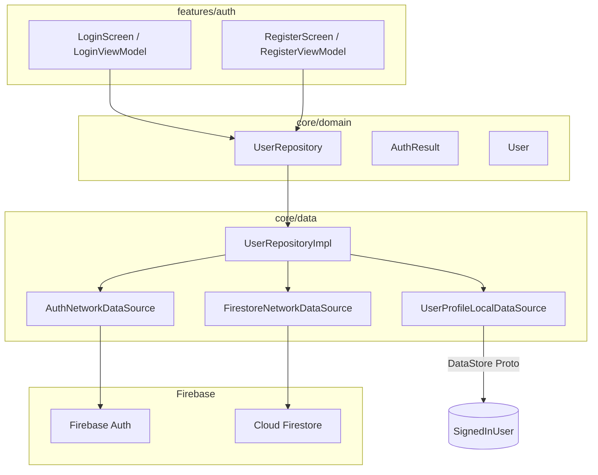
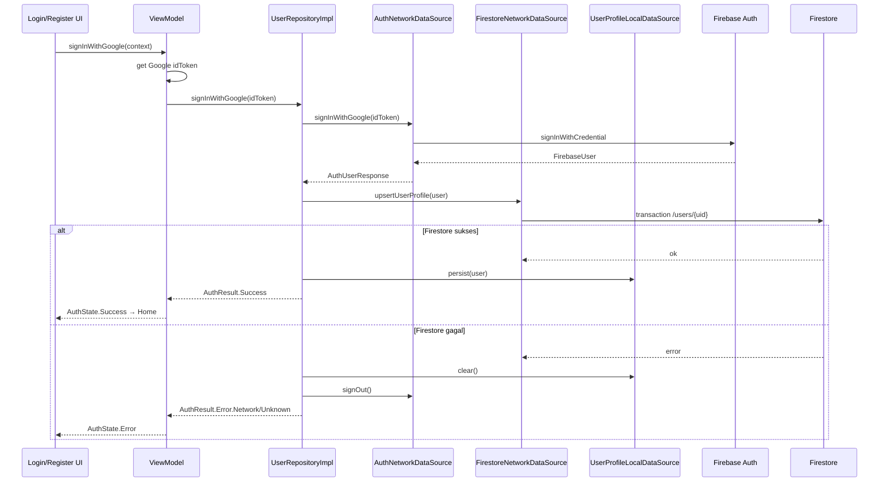
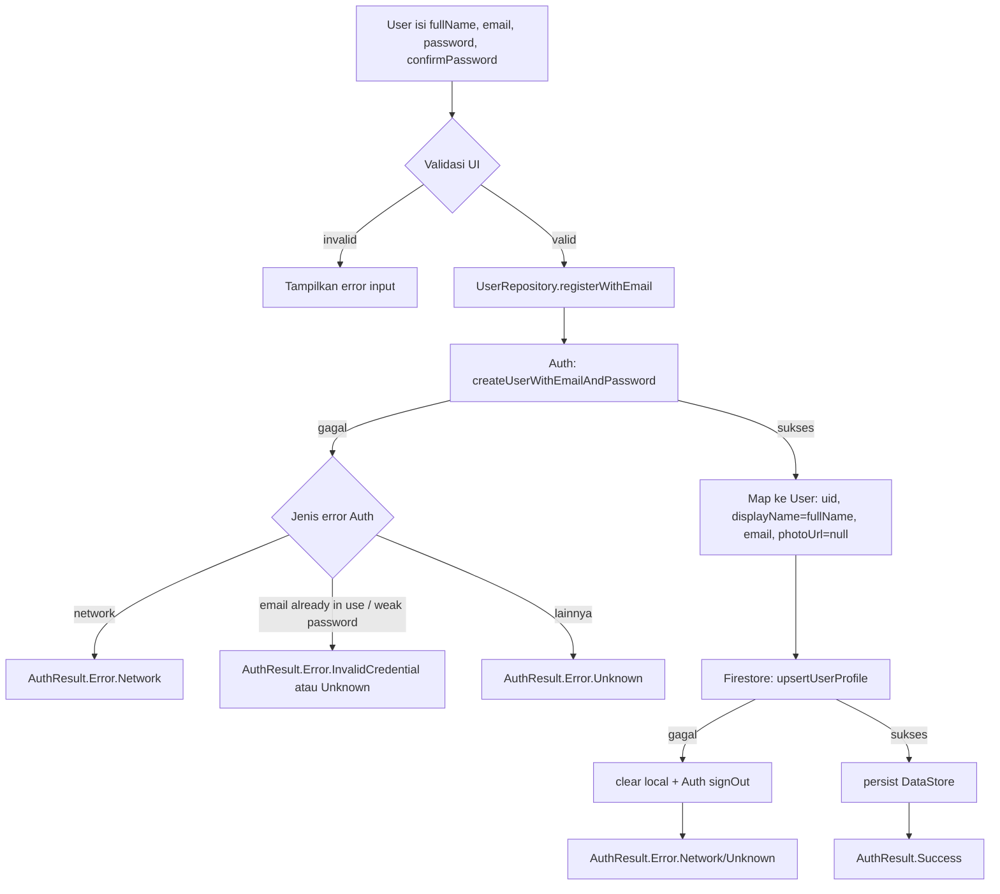
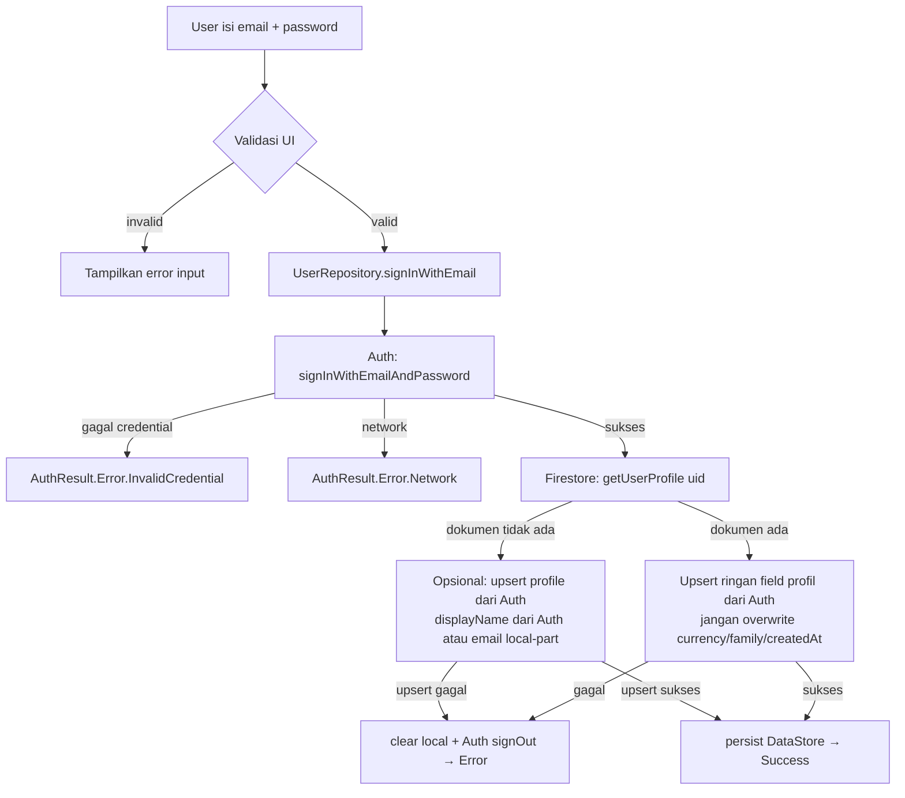
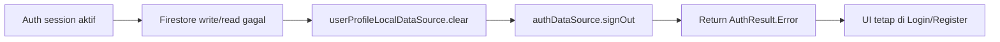

# Simpan Profil Auth ke Firestore

## Summary
- Setelah Firebase Auth sukses (Google **atau** email/password), app membuat/memperbarui dokumen profil di `/users/{uid}`.
- Credential (email + password, Google token) **hanya** divalidasi oleh Firebase Auth — tidak disimpan di Firestore.
- Firestore menyimpan profil aplikasi (`displayName`, `email`, `photoUrl`, `currency`, `familyId`, `familyRole`, `createdAt`).
- Jika langkah Firestore gagal setelah Auth sukses, login/register dianggap gagal: clear DataStore lokal, sign-out Firebase Auth, return error.

## Scope
| Alur | Auth provider | Firestore |
|---|---|---|
| Login Google | `signInWithCredential` | Upsert `/users/{uid}` |
| Register email/password | `createUserWithEmailAndPassword` | Create `/users/{uid}` (upsert aman) |
| Login email/password | `signInWithEmailAndPassword` | Baca/validasi dokumen `/users/{uid}` ada; upsert ringan field profil dari Auth jika perlu |
| Sign out | `signOut` | Tidak mengubah dokumen Firestore |

Out of scope:
- Forgot password / email verification UI (boleh ditambah belakangan).
- Menyimpan password, Google idToken, atau credential sensitif di Firestore.
- Family join / invite flow.

## Current State (baseline)
- Google sign-in Auth + persist DataStore lokal sudah jalan (`UserRepositoryImpl.signInWithGoogle`).
- UI Login/Register sudah ada; tombol email masih kosong (`onEmailLoginClick = {}`, `onSignUpClick = {}`).
- `FirestoreNetworkDataSource` masih stub kosong.
- `FirebaseModule` belum menyediakan `FirebaseFirestore`.
- Domain `UserRepository` hanya punya `signInWithGoogle` — belum ada API email.

## Target Architecture



### Pembagian tanggung jawab
| Layer | Tanggung jawab |
|---|---|
| Firebase Auth | Identitas + validasi credential (email/password atau Google) |
| Firestore | Dokumen profil aplikasi di `/users/{uid}` |
| DataStore | Cache lokal user yang sedang signed-in untuk UI offline/cepat |
| ViewModel | Validasi input UI, panggil repository, map `AuthResult` → `AuthState` |

## Flowcharts

### 1) Login Google



### 2) Register email/password



### 3) Login email/password



> Keputusan produk untuk login email jika dokumen Firestore hilang: **auto-upsert** dari data Auth (direkomendasikan), agar user yang sudah terdaftar di Auth tidak terblokir. Register tetap wajib menulis dokumen baru.

### 4) Rollback jika Firestore gagal



## Firestore Document Contract

Path: `/users/{uid}`

| Field | Type | Create (dokumen baru) | Update (dokumen sudah ada) |
|---|---|---|---|
| `uid` | string | set dari Auth | tidak diubah |
| `displayName` | string | dari Auth / input register | di-update dari Auth/input |
| `email` | string | dari Auth | di-update dari Auth |
| `photoUrl` | string? | dari Auth (Google) / null (email) | di-update dari Auth |
| `currency` | string | default `"IDR"` | **jangan overwrite** |
| `familyId` | string? | `null` | **jangan overwrite** |
| `familyRole` | string? | `null` | **jangan overwrite** |
| `createdAt` | timestamp | `FieldValue.serverTimestamp()` | **jangan overwrite** |
| `updatedAt` | timestamp | `serverTimestamp()` | `serverTimestamp()` |

Catatan:
- Password **tidak** pernah ditulis ke dokumen ini.
- `upsertUserProfile` memakai transaction: read dulu, lalu set/update sesuai aturan di atas.

## Key Changes

### 1. DI — `FirebaseModule`
- Tambah `@Provides @Singleton fun provideFirebaseFirestore(): FirebaseFirestore = Firebase.firestore`.

### 2. `FirestoreNetworkDataSource`
Isi method:
- `suspend fun upsertUserProfile(user: User)`
- `suspend fun getUserProfile(uid: String): User?` (untuk validasi login email)

Implementasi `upsertUserProfile` memakai transaction seperti kontrak di atas.

### 3. `AuthNetworkDataSource` (+ Impl)
Tambah:
- `suspend fun registerWithEmail(email: String, password: String, displayName: String): AuthUserResponse?`
  - `createUserWithEmailAndPassword`
  - Opsional: `updateProfile(displayName)` setelah create
- `suspend fun signInWithEmail(email: String, password: String): AuthUserResponse?`
  - `signInWithEmailAndPassword`

### 4. Domain API — `UserRepository`
Tambah (API yang sebelumnya hanya Google):
```kotlin
suspend fun registerWithEmail(
    fullName: String,
    email: String,
    password: String,
): AuthResult

suspend fun signInWithEmail(
    email: String,
    password: String,
): AuthResult
```
`signInWithGoogle`, `signOut`, `getCurrentUser`, `syncUserProfile` tetap ada.

### 5. `UserRepositoryImpl` — urutan baku semua alur
1. Auth sukses → dapat `User` domain.
2. Firestore upsert/get sesuai alur.
3. Jika Firestore sukses → `userProfileLocalDataSource.persist(user)` → `AuthResult.Success(user)`.
4. Jika Firestore gagal → `clear()` lokal + `authDataSource.signOut()` → map error.
5. Map exception:
   - `FirebaseNetworkException` / Firestore unavailable → `AuthResult.Error.Network`
   - Auth wrong password / user not found / email in use → `AuthResult.Error.InvalidCredential` (atau `UserNotFound` bila cocok)
   - Permission / rules / lainnya → `AuthResult.Error.Unknown`

### 6. Feature Auth UI wiring
- `RegisterViewModel.registerWithEmail(fullName, email, password)`
- `LoginViewModel.signInWithEmail(email, password)`
- `RegisterRouting`: hubungkan `onSignUpClick` ke ViewModel (kirim field dari screen).
- `LoginRouting`: hubungkan `onEmailLoginClick` ke ViewModel.
- Validasi UI minimal:
  - email tidak kosong + format sederhana
  - password tidak kosong; register: password == confirmPassword, min length (mis. 6, sesuai Firebase default)
  - fullName tidak kosong saat register

### 7. `syncUserProfile` (opsional dalam PR yang sama)
- Implementasi: baca Auth current user → upsert Firestore → refresh DataStore.
- Bisa digarap bersamaan atau follow-up kecil setelah login flows jalan.

## Public API / Types
- `AuthResult` **tetap sama** (tidak perlu sealed class baru).
- `User` domain **tetap sama**.
- `UserRepository` **ditambah** method email (breaking kecil di interface, expected).
- Tidak menambah dependency baru di feature module untuk Firestore langsung — feature hanya bicara ke `UserRepository`.

## Error Mapping Cheatsheet
| Sumber | Contoh | `AuthResult` |
|---|---|---|
| Auth | `ERROR_WRONG_PASSWORD`, `ERROR_INVALID_CREDENTIAL` | `Error.InvalidCredential` |
| Auth | `ERROR_USER_NOT_FOUND` | `Error.UserNotFound` |
| Auth | `ERROR_EMAIL_ALREADY_IN_USE` | `Error.InvalidCredential` (message UI: email sudah terdaftar) |
| Auth/Firestore | network / unavailable | `Error.Network` |
| Firestore | permission-denied / lainnya | `Error.Unknown` |
| Google | user batalkan picker | `Cancelled` |

## File Touch List
| File | Perubahan |
|---|---|
| `core/data/.../di/FirebaseModule.kt` | Provide `FirebaseFirestore` |
| `core/data/.../datasource/FirestoreNetworkDataSource.kt` | `upsertUserProfile`, `getUserProfile` |
| `core/data/.../datasource/AuthNetworkDataSource.kt` | Method email |
| `core/data/.../datasource/AuthNetworkDataSourceImpl.kt` | Impl email Auth |
| `core/domain/.../repository/UserRepository.kt` | API email |
| `core/data/.../repository/UserRepositoryImpl.kt` | Orkestrasi Auth → Firestore → Local + rollback |
| `features/auth/.../LoginViewModel.kt` | `signInWithEmail` |
| `features/auth/.../RegisterViewModel.kt` | `registerWithEmail` |
| `features/auth/.../LoginScreen.kt` | Wire email login callback + kirim field |
| `features/auth/.../RegisterScreen.kt` | Wire sign-up callback + kirim field |

## Test Plan
1. `./gradlew assembleDebug`
2. **Google login pertama**
   - Masuk Home.
   - Firestore Console: `/users/{uid}` ada, `createdAt` terisi, `currency = IDR`.
3. **Google login ulang**
   - Tidak membuat dokumen duplikat.
   - `createdAt`, `currency`, `familyId`, `familyRole` tidak berubah; `displayName`/`photoUrl`/`email` boleh ter-update.
4. **Register email**
   - Akun baru di Firebase Auth.
   - Dokumen `/users/{uid}` terbuat dengan `displayName` dari full name.
   - Session lokal tersimpan; masuk Home.
5. **Register email duplikat**
   - Error jelas di UI; tidak masuk Home.
6. **Login email sukses**
   - Auth valid → dokumen Firestore terbaca/ter-upsert → Home.
7. **Login email password salah**
   - `InvalidCredential`; tidak ada session lokal.
8. **Failure Firestore**
   - Simulasikan rules deny write.
   - Auth session dibersihkan, DataStore kosong, UI tetap di auth screen.

## Google Sign-In UI (Credential Manager)

Tombol **Sign in with Google** di Login/Register memakai explicit SIWG button flow — **bukan** One Tap bottom sheet.

| | API | UI tipikal |
|---|-----|------------|
| ~~Sebelum~~ | `GetGoogleIdOption` | One Tap → **bottom sheet** |
| **Sekarang** | `GetSignInWithGoogleOption` | Explicit SIWG → **account picker dialog** |

Implementasi: `features/auth/.../data/GoogleSignInTokenProvider.kt`.

**Kenapa diganti:** One Tap sering `NoCredentialException` di cold start (GMS belum siap) → UI sempat bilang seolah tidak ada akun Google, padahal tap kedua berhasil. Untuk tap tombol eksplisit, Android Identity merekomendasikan `GetSignInWithGoogleOption` (account picker lebih andal).

**Bukan bug UI** — trade-off disengaja: bottom sheet One Tap diganti dialog SIWG demi reliability. Hybrid (One Tap dulu → fallback SIWG) ditunda; lihat [`PHASE_AUTH_GOOGLE_SIGNIN_CREDENTIAL_STABILITY.md`](../dev/phases/PHASE_AUTH_GOOGLE_SIGNIN_CREDENTIAL_STABILITY.md).

Pesan error Google `NoCredential`: lihat [`FIREBASE_AUTH_ERROR_MAPPING.md`](./FIREBASE_AUTH_ERROR_MAPPING.md).

## Assumptions
- Firestore rules mengizinkan user authenticated read/write dokumen miliknya sendiri di `/users/{uid}`.
- Tidak menyimpan password, Google token, atau credential lain di Firestore / DataStore.
- Email/password Auth diaktifkan di Firebase Console.
- Google Sign-In memakai Credential Manager **SIWG** (`GetSignInWithGoogleOption`) → idToken → `UserRepository.signInWithGoogle` (lihat bagian di atas).
- Default `currency = "IDR"` untuk user baru.
- Login email dengan dokumen Firestore hilang akan **auto-upsert** dari data Auth, bukan hard-fail `UserNotFound`.

## Implementation Order
1. DI `FirebaseFirestore` + isi `FirestoreNetworkDataSource`.
2. Auth email methods di data source.
3. Perluas `UserRepository` + orkestrasi di `UserRepositoryImpl` (termasuk Google path yang sudah ada).
4. Wire `RegisterViewModel` / `LoginViewModel` + UI callbacks.
5. Manual test sesuai Test Plan.
6. Hapus/arsipkan TODO `syncUserProfile` bila sudah diimplementasikan, atau biarkan follow-up.
