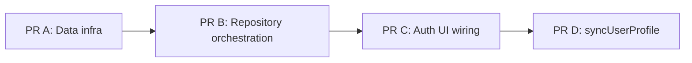
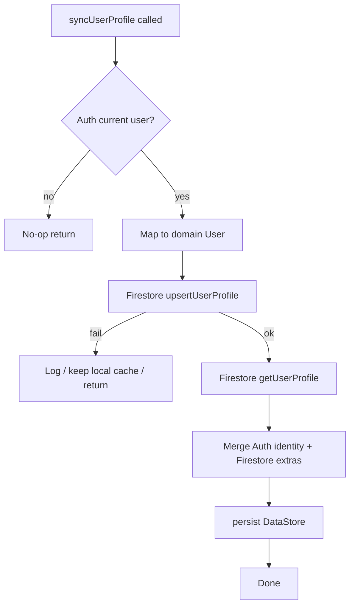

# PR D — Sync User Profile (Auth → Firestore → Local)

Parent plan: [`FIRESTORE_LOGIN_INTEGRATION.md`](./FIRESTORE_LOGIN_INTEGRATION.md)  
Related docs:
- [`PR_A_FIRESTORE_AUTH_INFRA.md`](./PR_A_FIRESTORE_AUTH_INFRA.md)
- [`PR_B_USER_REPOSITORY_ORCHESTRATION.md`](./PR_B_USER_REPOSITORY_ORCHESTRATION.md)
- [`PR_C_AUTH_UI_WIRING.md`](./PR_C_AUTH_UI_WIRING.md)
- [`FIREBASE_AUTH_ERROR_MAPPING.md`](./FIREBASE_AUTH_ERROR_MAPPING.md)

## Goal
Implement the **last remaining in-scope item** from `FIRESTORE_LOGIN_INTEGRATION.md`:

> Key Change #7 / Implementation Order #6 — `syncUserProfile()`

Today `UserRepository.syncUserProfile()` exists but is still a TODO. This PR should:

1. Read the current Firebase Auth user.
2. Upsert (or reconcile) the Firestore `/users/{uid}` profile.
3. Refresh the local DataStore cache with the best available profile (Auth + Firestore fields).

After this PR, cold starts / settings / splash can refresh profile data (including `currency`, `familyId`, `familyRole`) instead of only hydrating Auth identity fields.

## Remaining Work Snapshot (from parent plan)

| Item from `FIRESTORE_LOGIN_INTEGRATION.md` | Status after PR A–C | This PR |
|---|---|---|
| 1. DI `FirebaseFirestore` | Done | — |
| 2. `FirestoreNetworkDataSource` upsert/get | Done | Consume |
| 3. Auth email data source | Done | — |
| 4. Domain email APIs | Done | — |
| 5. Repository Auth → Firestore → Local + rollback | Done | Extend with sync |
| 6. Auth UI wiring | Done | Optional call sites only |
| **7. `syncUserProfile()`** | **TODO** | **In scope** |
| Forgot password / email verification | Explicitly out of scope | Future PR (listed below) |
| Family join / invite | Explicitly out of scope | Future PR |



## Why this matters

Current `getCurrentUser()` onStart only does:

```text
Auth current user → map to User → persist local
```

That **drops / never refreshes** Firestore-only fields (`currency`, `familyId`, `familyRole`) on cold start.  
`syncUserProfile()` is the intended path to pull Auth + Firestore into local cache after login flows are already complete.

## In Scope
1. Implement `UserRepositoryImpl.syncUserProfile()`.
2. Define clear success/failure semantics (see below).
3. Prefer enriching local cache from Firestore after upsert.
4. Optionally wire a call site (recommended): Splash and/or Settings refresh.
5. Keep feature modules free of direct Firestore SDK usage.

## Out of Scope
- Forgot password UI / `sendPasswordResetEmail`
- Email verification UI / `sendEmailVerification`
- Expanding all ❌ Auth error codes from `FIREBASE_AUTH_ERROR_MAPPING.md` (can be PR E)
- Changing login/register orchestration from PR B
- Family invite/join flows
- Rewriting Firestore document contract

## Prerequisites
Confirm these already exist (from PR A/B):
- `AuthNetworkDataSource.getCurrentUser()`
- `FirestoreNetworkDataSource.upsertUserProfile(user)`
- `FirestoreNetworkDataSource.getUserProfile(uid)`
- `UserProfileLocalDataSource.persist(user)` / `clear()`
- `AuthUserMapper.mapToDomainOrNull(...)`
- Login/register already write `/users/{uid}` successfully

## Recommended Behavior

### Happy path

```text
1. authUser = authDataSource.getCurrentUser()
2. if authUser == null → no-op return (or clear local if you want strict signed-out sync)
3. domainUser = mapper.mapToDomain(authUser)
4. firestoreDataSource.upsertUserProfile(domainUser)
5. existing = firestoreDataSource.getUserProfile(domainUser.uid)
6. userToPersist = existing?.copy(
       displayName = domainUser.displayName,
       email = domainUser.email,
       photoUrl = domainUser.photoUrl,
   ) ?: domainUser
7. userProfileLocalDataSource.persist(userToPersist)
```

Notes:
- Step 4 keeps Auth profile fields fresh in Firestore (same create/update rules as login).
- Step 5–6 prefer returning Firestore-enriched fields to local DataStore (same idea as email login `resolveUserForPersist` in PR B).
- Do **not** overwrite `currency` / `familyId` / `familyRole` / `createdAt` in Firestore update path — already enforced inside `upsertUserProfile`.

### Failure behavior

| Situation | Recommended behavior |
|---|---|
| No Auth user | No-op (return). Do not crash. |
| Firestore upsert/get fails | Do **not** sign the user out (unlike login rollback). Sync is best-effort refresh. Keep existing local cache. Log in `dev` flavor if logging helper already exists. |
| Cancellation | Rethrow `CancellationException`. |

> Important difference from login/register: **sync failure should not call `rollbackAuthSession()`**. Signing the user out on a background refresh would be surprising UX.

### Optional API shape improvement (only if needed)

Current domain API:

```kotlin
suspend fun syncUserProfile()
```

Keep this signature for PR D unless callers need a result. If you want observability later, a follow-up can change to `suspend fun syncUserProfile(): Result<User>` / `SyncResult`, but that is not required now.

## Target Flow



## Files to Change

### Must edit
| File | Why |
|---|---|
| [`core/data/src/main/kotlin/com/mascill/keutrack/core/data/repository/UserRepositoryImpl.kt`](../../core/data/src/main/kotlin/com/mascill/keutrack/core/data/repository/UserRepositoryImpl.kt) | Replace TODO with real sync implementation |

### Likely edit (recommended call site)
| File | Why |
|---|---|
| [`features/splashscreen/src/main/kotlin/com/mascill/keutrack/feature/splashscreen/presentation/SplashViewModel.kt`](../../features/splashscreen/src/main/kotlin/com/mascill/keutrack/feature/splashscreen/presentation/SplashViewModel.kt) | Call `syncUserProfile()` before/alongside session routing so Home gets enriched profile |
| and/or [`features/settings/.../SettingsViewModel.kt`](../../features/settings/src/main/kotlin/com/mascill/keutrack/feature/settings/presentation/SettingsViewModel.kt) | Refresh profile when Settings opens |

### Reference only
| File | Why it matters |
|---|---|
| [`FIRESTORE_LOGIN_INTEGRATION.md`](./FIRESTORE_LOGIN_INTEGRATION.md) | Key Change #7 + document contract |
| [`PR_B_USER_REPOSITORY_ORCHESTRATION.md`](./PR_B_USER_REPOSITORY_ORCHESTRATION.md) | `completeSignIn` / `resolveUserForPersist` patterns to reuse |
| [`core/domain/.../UserRepository.kt`](../../core/domain/src/main/kotlin/com/mascill/keutrack/core/domain/repository/UserRepository.kt) | Existing `syncUserProfile()` API |
| [`core/data/.../FirestoreNetworkDataSource.kt`](../../core/data/src/main/kotlin/com/mascill/keutrack/core/data/datasource/FirestoreNetworkDataSource.kt) | `upsertUserProfile` / `getUserProfile` |
| [`core/data/.../AuthNetworkDataSource.kt`](../../core/data/src/main/kotlin/com/mascill/keutrack/core/data/datasource/AuthNetworkDataSource.kt) | `getCurrentUser()` |
| [`core/domain/.../User.kt`](../../core/domain/src/main/kotlin/com/mascill/keutrack/core/domain/model/User.kt) | Fields to preserve/enrich |

### Explicitly leave alone
| File / area | Reason |
|---|---|
| Login/Register UI auth flows | Already complete in PR C |
| Firestore field create/update rules | Already correct in PR A |
| Forgot Password label on LoginScreen | Future PR |

## Implementation Guide

### Step 1 — Implement repository method

In `UserRepositoryImpl`:

```kotlin
override suspend fun syncUserProfile() {
    val authUser = mapper.mapToDomainOrNull(authDataSource.getCurrentUser()) ?: return
    try {
        firestoreDataSource.upsertUserProfile(authUser)
        val userToPersist = resolveUserForPersist(authUser)
        userProfileLocalDataSource.persist(userToPersist)
    } catch (e: CancellationException) {
        throw e
    } catch (e: Exception) {
        // Best-effort: do not sign out on sync failure.
        logFailure("syncUserProfile", e) // if helper exists
    }
}
```

Reuse existing private `resolveUserForPersist(authUser)` from PR B to avoid duplication.

### Step 2 — Decide splash wiring (recommended)

In `SplashViewModel.checkOnGoingNavigation()`:

Option A — sync only if signed in, then route:

```text
user = getCurrentUser().first()
if (user != null) {
    userRepository.syncUserProfile() // refresh Firestore → local
}
// then route Home/Auth based on getCurrentUser again or original user
```

Option B — fire-and-forget after deciding Home:

```text
if (user != null) {
    launch { userRepository.syncUserProfile() }
    NavigateToHome
}
```

Prefer **Option A** if Settings/Dashboard need correct `currency`/`family*` immediately; Prefer **Option B** if splash latency matters more.

Keep splash resilient: sync failure must not block navigation to Home if local session already exists.

### Step 3 — Optional Settings refresh

If Settings shows profile details:

```kotlin
init / onStart {
    viewModelScope.launch {
        runCatching { userRepository.syncUserProfile() }
        userRepository.getCurrentUser().collect { ... }
    }
}
```

### Step 4 — Do not change login rollback semantics

Login/register still rollback Auth+local on Firestore failure.  
Sync does **not**.

## Acceptance Criteria
- [ ] `syncUserProfile()` no longer a TODO.
- [ ] When Auth user exists: upserts `/users/{uid}` and refreshes local DataStore.
- [ ] When Firestore profile exists: local cache keeps/receives `currency` / `familyId` / `familyRole`.
- [ ] When Auth user is null: method returns safely.
- [ ] Sync failure does **not** sign the user out.
- [ ] Protected Firestore fields remain non-overwritten on update (`currency`, `family*`, `createdAt`).
- [ ] `./gradlew :core:data:compileDebugKotlin` (and any touched feature modules) succeeds.

## Test Plan
1. Build:
   ```bash
   ./gradlew assembleDebug
   ```
2. **Signed-in user, existing Firestore doc**
   - Change `displayName` in Firebase Auth (or login with updated Google profile).
   - Trigger sync (app cold start / Settings).
   - Firestore profile fields updated; `createdAt`/`currency` unchanged.
   - Local DataStore reflects enriched profile.
3. **Signed-in user, missing Firestore doc**
   - Delete `/users/{uid}` in console.
   - Trigger sync.
   - Document recreated with defaults (`currency = IDR`, `family* = null`).
4. **Signed-out**
   - Call sync (or open splash signed out).
   - No crash; stays on Auth.
5. **Firestore unavailable**
   - Simulate offline / deny rules temporarily.
   - User remains signed in locally; no forced logout.

## Draft PR Description

```markdown
## Summary
- Implement UserRepository.syncUserProfile to upsert Firestore profile and refresh local DataStore.
- Keep sync best-effort: failures do not sign the user out.
- Optionally refresh profile on splash/settings so Home sees currency/family fields.

## Out of scope
- Forgot password / email verification
- Broader Auth error-code catalog expansion

## Test plan
- [ ] ./gradlew assembleDebug
- [ ] Sync updates existing /users/{uid} without clobbering currency/family/createdAt
- [ ] Sync recreates missing profile doc
- [ ] Sync failure keeps local session
```

## Future PRs (remaining outside this parent Key Change #7)

These are **not** required to close `FIRESTORE_LOGIN_INTEGRATION.md` Key Changes 1–7, but are natural follow-ups:

| Future PR | Scope | Notes |
|---|---|---|
| **PR E — Auth error mapping expansion** | Map high-priority ❌ codes from [`FIREBASE_AUTH_ERROR_MAPPING.md`](./FIREBASE_AUTH_ERROR_MAPPING.md) (`ERROR_OPERATION_NOT_ALLOWED`, token expired, network request failed, etc.) | Improves UX beyond `Unknown(message)` |
| **PR F — Forgot password** | Wire Login “Forgot Password?” → `sendPasswordResetEmail` + UI | Explicitly out of scope in parent plan |
| **PR G — Email verification** | Optional verify-email gate / banner | Explicitly out of scope in parent plan |
| **PR H — Firestore security rules in repo** | Add/version `firestore.rules` for `/users/{uid}` owner read/write | Parent assumes rules exist in Console |

## Done Definition for Parent Plan
When PR D merges, `FIRESTORE_LOGIN_INTEGRATION.md` Key Changes **1–7** are complete:

1. FirebaseFirestore DI  
2. Firestore upsert/get  
3. Auth email APIs  
4. Domain repository email APIs  
5. Auth → Firestore → Local orchestration + rollback  
6. Login/Register UI wiring  
7. **`syncUserProfile` implemented**
